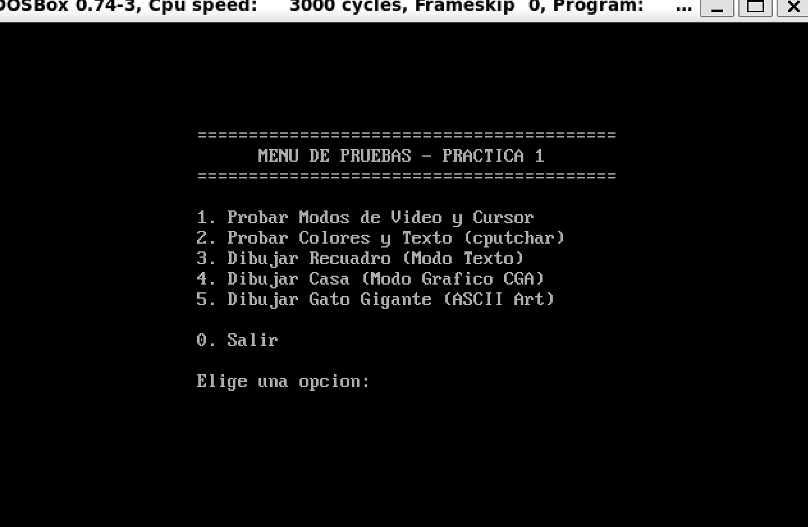
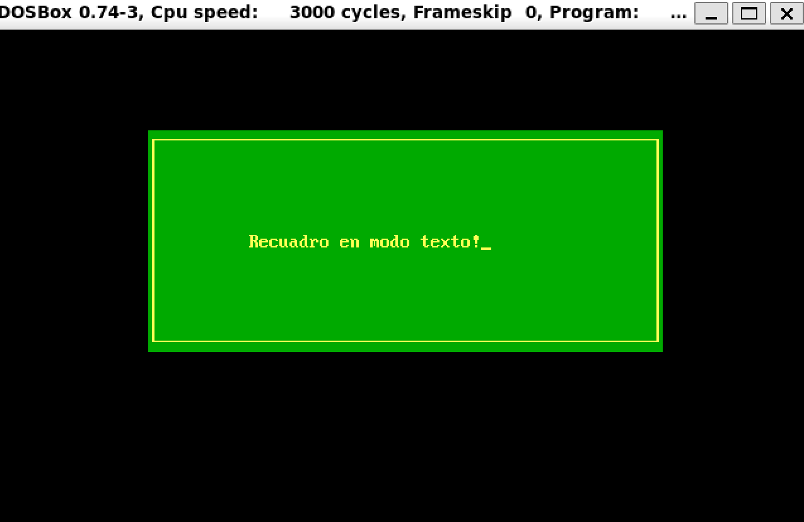
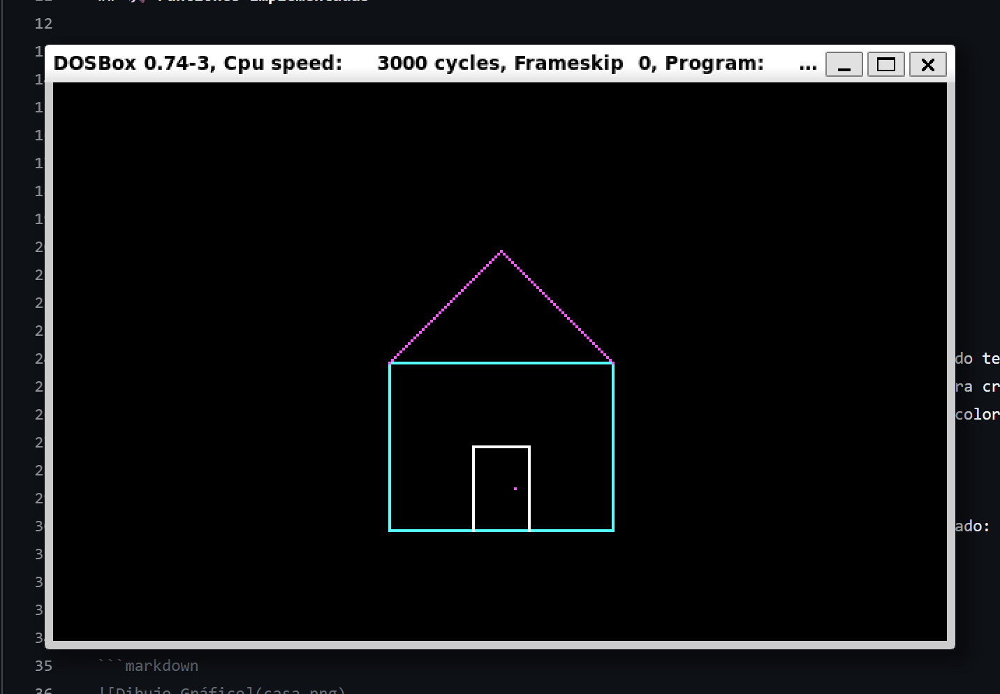
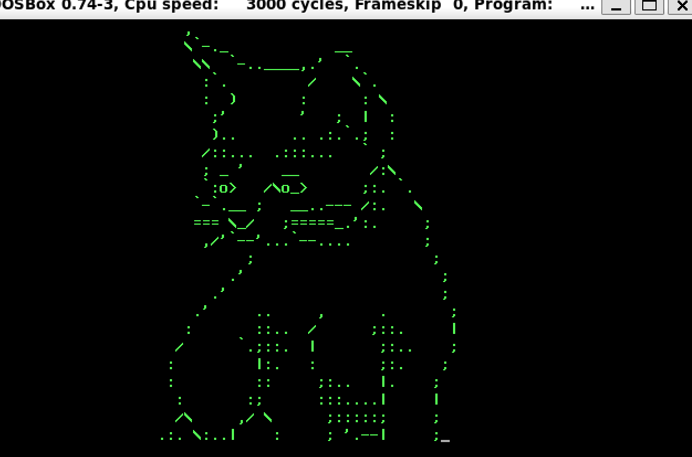

# Práctica 1: Librería de E/S mediante Interrupciones BIOS

## Estructura del Proyecto

* **`mi_io.h`**: Archivo de cabecera con los prototipos de todas las funciones implementadas.
* **`mi_io.c`**: Implementación de la librería con el código de las interrupciones BIOS.
* **`main.c`**: Programa principal que implementa un menú interactivo para evaluar las funcionalidades.

## Funciones Implementadas

### Requisitos Mínimos

* **`gotoxy(x, y)`**: Posicionamiento del cursor (INT 10h, AH=02h).
* **`setcursortype(modo)`**: Selección de cursor invisible, normal o grueso (INT 10h, AH=01h).
* **`setvideomode(modo)`**: Cambio de modo de video (INT 10h, AH=00h).
* **`getvideomode()`**: Consulta del modo de video actual (INT 10h, AH=0Fh).
* **`textcolor()` / `textbackground()`**: Gestión de atributos de color.
* **`clrscr()`**: Borrado de pantalla mediante scroll (INT 10h, AH=06h).
* **`cputchar(c)`**: Escritura de carácter con atributo y avance de cursor (INT 10h, AH=09h).
* **`getche()`**: Lectura de teclado con eco (INT 16h, AH=00h).

### Requisitos Ampliados (Extras)

* **Dibujo de recuadros**: `dibujar_cuadrado()` genera ventanas con bordes de la tabla ASCII extendida.
* **Modo Gráfico CGA**: Función `pixel()` y una escena completa (`dibujar_dibujo()`) en modo 320x200.
* **ASCII Art**: `dibujar_gato_gigante()` renderiza arte complejo de 24 líneas gestionando caracteres de escape.

## Capturas

### Menú Principal Interactvo
Interfaz del programa principal controlada mediante la lectura de teclado (`getche`) y limpieza de pantalla (`clrscr`).

### 1. Dibujo de Recuadros (Modo Texto)
Captura de la función dibujar_cuadrado() con bordes ASCII y colores.

### 2. Modo Gráfico (CGA)
Captura de la funcion dibujar_dibujo(), una casa dibujada píxel a píxel en modo 4 (320x200).

### 3. ASCII Art (Gato Gigante)
Captura de la funcion dibujar_gato_grande() en formato ASCII respetando el posicionamiento y color.

