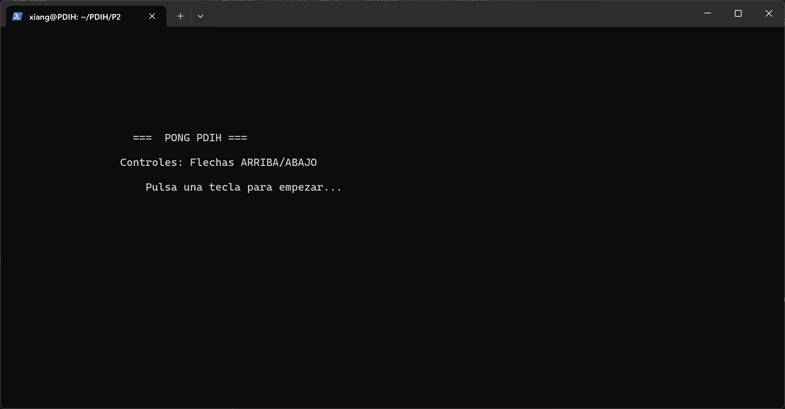
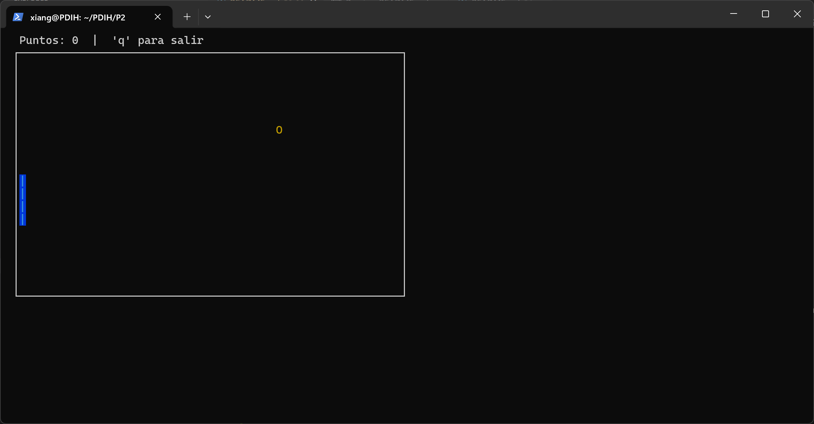
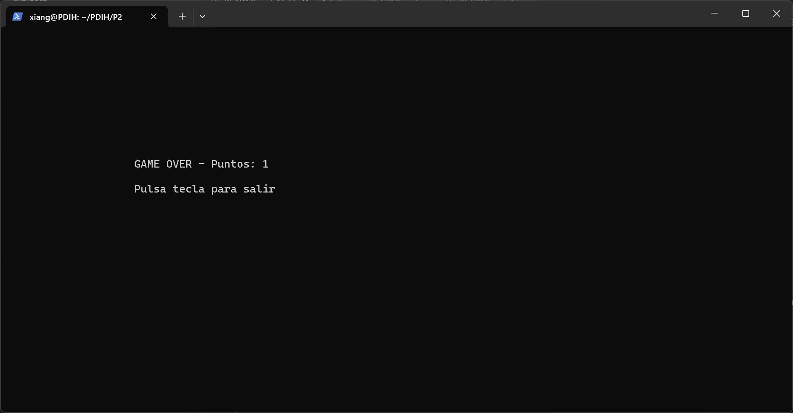

# Práctica 2: Interfaces de Usuario en Modo Texto (ncurses)

## Contenido del Proyecto
E juego incluye:
- **Pantalla de Bienvenida:** Presentación del autor y explicación de controles.
- **Interfaz de Juego:** Ventana independiente con bordes (`box`) y gestión de colores.
- **Lógica de Juego:** Movimiento de pelota con rebotes y detección de colisiones con la pala.
- **Sistema de Puntuación:** Marcador en tiempo real en la parte superior.
- **Pantalla de Game Over:** Resumen de puntos y opción de salida limpia.

Para compilar este proyecto, es necesario instalar las dependencias de `ncurses`:
```bash
sudo apt update
sudo apt install build-essential libncurses5-dev libncursesw5-dev
```

## Compilación y Ejecución

```bash
gcc pong_final.c -o pong -lncurses
./pong
```

## Controles
- **Flecha Arriba:** Mueve la pala hacia arriba.
- **Flecha Abajo:** Mueve la pala hacia abajo.
- **Tecla Q:** Salir del juego en cualquier momento.

## Pruebas de Funcionamiento

### 1\. Pantalla de Bienvenida e Instrucciones

Muestra los controles y espera a que el usuario pulse una tecla para iniciar.


### 2\. Gameplay en Tiempo Real

Se observa la ventana de juego con bordes, colores para pelota y pala, y el marcador actualizado en la parte superior.


### 3\. Pantalla de Game Over

Estado final del juego tras perder la pelota, mostrando la puntuación definitiva.


## Estructura del Repositorio
- `hola.c`: Prueba básica de inicialización de ncurses.
- `ventana.c`: Ejemplo de gestión de ventanas y colores.
- `pelota.c`: Lógica base de movimiento y rebotes.
- `pong_final.c`: Código fuente completo del juego final.
- `README.md`: Documentación del proyecto.


