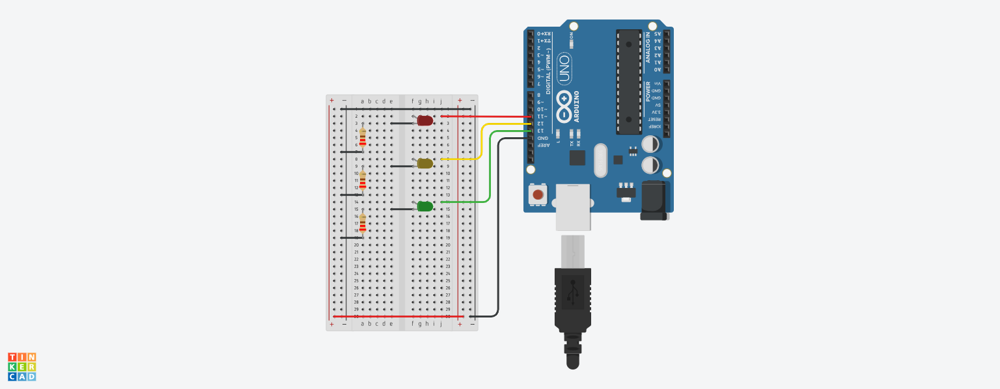
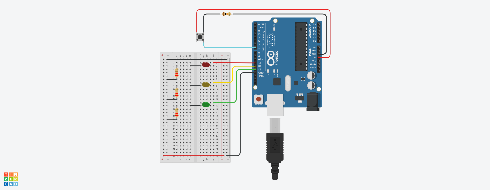
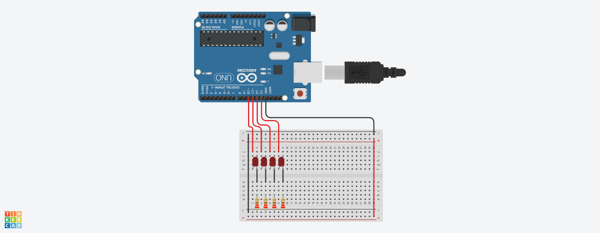
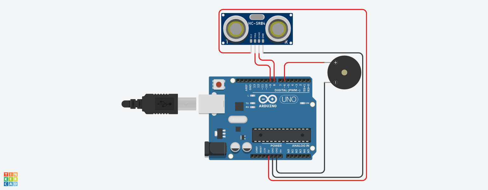
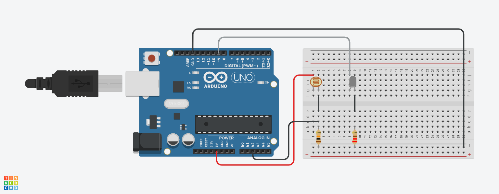
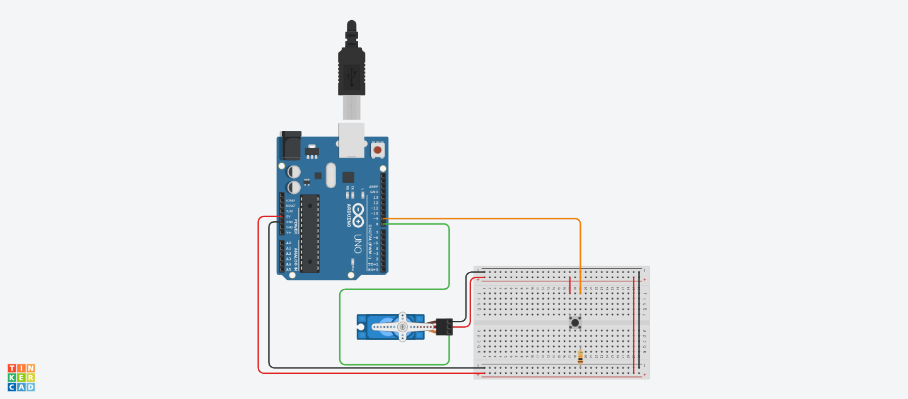
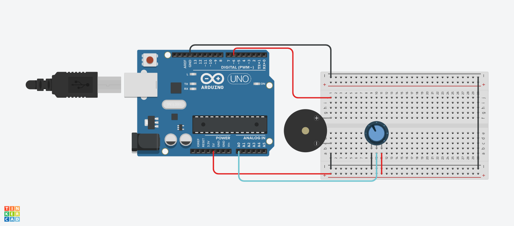

# Práctica 3: Experimentación con Arduino

## Requisito 1: Semáforo de 3 LEDs

### Identificación de componentes

| Componente | Pin Arduino |
| :--- | :--- |
| **LED Rojo** | Pin 11 |
| **LED Amarillo** | Pin 12 |
| **LED Verde** | Pin 13 |
| **Resistencias 220Ω (x3)** | Una por cada LED |

### Esquema de conexiones


### Código Fuente

```cpp
void setup()
{
  // Configuración de los pines como salida
  pinMode(11, OUTPUT);
  pinMode(12, OUTPUT);
  pinMode(13, OUTPUT);
}

void loop()
{
  // Enciende el LED 11 y espera 1.5 segundos
  digitalWrite(11, HIGH);
  delay(1500); 
  digitalWrite(11, LOW);

  // Enciende el LED 12 y espera 1.5 segundos
  digitalWrite(12, HIGH);
  delay(1500);
  digitalWrite(12, LOW);

  // Enciende el LED 13 y espera 1.5 segundos
  digitalWrite(13, HIGH);
  delay(1500);
  digitalWrite(13, LOW);
}
```

### Muestra de funcionamiento

> **[ Haz clic aquí para ver el vídeo de la secuencia de 3 LEDs](https://drive.google.com/file/d/11bFytVKYp34fu2wRTl2E3FNA-WSxzAsH/view?usp=drive_link)**

-----

## Requisito 2: Control con Interruptor

### Identificación de componentes

| Componente | Pin Arduino |
| :--- | :--- |
| **LED Rojo** | Pin 11 |
| **LED Amarillo** | Pin 12 |
| **LED Verde** | Pin 13 |
| **Pulsador** | Pin 7 |
| **Resistencias 220Ω (x3)** | Para los LEDs |
| **Resistencia 10kΩ** | Para el pulsador |

### Esquema de conexiones


### Código Fuente

```cpp
void setup()
{
  // Configuración de salidas para los LEDs
  pinMode(11, OUTPUT);
  pinMode(12, OUTPUT);
  pinMode(13, OUTPUT);
  
  // Configuración del pin 7 como entrada para el pulsador
  pinMode(7, INPUT);
}

void loop()
{
  // Si el pulsador está presionado (entrada en HIGH)
  if (digitalRead(7) == HIGH)
  {
    // Solo el LED 11 permanece encendido
    digitalWrite(11, HIGH);  
    digitalWrite(12, LOW );  
    digitalWrite(13, LOW );  
  }
  // Si el pulsador no está presionado
  else
  {
    // Ejecuta la secuencia cíclica de 1.5 segundos por LED
    digitalWrite(11, HIGH);
    delay(1500); 
    digitalWrite(11, LOW);

    digitalWrite(12, HIGH);
    delay(1500);
    digitalWrite(12, LOW);

    digitalWrite(13, HIGH);
    delay(1500);
    digitalWrite(13, LOW);
  }
}
```

### Muestra de funcionamiento

> **[ Haz clic aquí para ver el vídeo del semáforo con pulsador](https://drive.google.com/file/d/1mNK3afYGAeXAkLNNbqj_iWbB6z6kFUne/view?usp=drive_link)**

-----

## Requisito Ampliado 1: Secuencia de LEDs

### Identificación de componentes

| Componente | Pin Arduino |
| :--- | :--- |
| **LED Rojo (x4)** | Pines 10, 11, 12 y 13 |
| **Resistencia 220Ω (x4)** | Una por cada LED |

### Esquema de conexiones


### Código Fuente

```cpp
void setup()
{
  // Configuración de los pines 10 al 13 como salidas
  pinMode(10, OUTPUT);
  pinMode(11, OUTPUT);
  pinMode(12, OUTPUT);
  pinMode(13, OUTPUT);
}

void loop()
{
  // Secuencia de ida: del pin 10 al 13
  digitalWrite(10, HIGH); delay(100); digitalWrite(10, LOW);
  digitalWrite(11, HIGH); delay(100); digitalWrite(11, LOW);
  digitalWrite(12, HIGH); delay(100); digitalWrite(12, LOW);
  digitalWrite(13, HIGH); delay(100); digitalWrite(13, LOW);
  
  // Secuencia de vuelta: del pin 12 al 11
  digitalWrite(12, HIGH); delay(100); digitalWrite(12, LOW);
  digitalWrite(11, HIGH); delay(100); digitalWrite(11, LOW);
}
```

### Muestra de funcionamiento

> **[ Haz clic aquí para ver el vídeo de la secuencia de LEDs](https://drive.google.com/file/d/1MZv-iwTlAnRQHXVWCCHKRIWKzO15Nl_5/view?usp=drive_link)**

-----

## Requisito Ampliado 2: Detector de la distancia

### Identificación de componentes

| Componente | Pin Arduino |
| :--- | :--- |
| **Sensor Ultrasonidos** | Trig:Pin 9, Echo: Pin 8 |
| **Buzzer** | Pin 6 |

### Esquema de conexiones


### Código Fuente

```cpp
void setup()
{
  pinMode(6, OUTPUT); // Pin para el zumbador
  pinMode(8, INPUT);  // Pin Echo del sensor 
  pinMode(9, OUTPUT); // Pin Trig del sensor 
}

void loop()
{
  // Generamos el pulso de activación del sensor (Trigger)
  digitalWrite(9, HIGH);
  delayMicroseconds(10);
  digitalWrite(9, LOW);

  // pulseIn mide cuánto tiempo tarda el pin 8 (Echo) en volver a HIGH
  long duracion = pulseIn(8, HIGH); 
  
  // Convertimos el tiempo en distancia (cm)
  // La velocidad del sonido es 343 m/s (0.0343 cm/us), se divide por 2 por el ida y vuelta
  int distancia = duracion * 0.01723; 
  
  // Filtro de distancia para activar el sonido (entre 5 y 330 cm)
  if (distancia > 5 && distancia < 330) {
    
    // MAPEO DE FRECUENCIA: A menor distancia, sonido más agudo (2000Hz)
    int tono = map(distancia, 3, 330, 2000, 500); 
    
    tone(6, tono);          // Genera el sonido
    delay(100);             // Duración del pitido
    noTone(6);              // Silencio momentáneo
    
    // MAPEO DE RITMO: A menor distancia, los pitidos son más rápidos
    int pausa = map(distancia, 3, 330, 20, 500); 
    delay(pausa); 
  }
}
```

### Muestra de funcionamiento

> **[ Haz clic aquí para ver el vídeo del detector de distancia](https://drive.google.com/file/d/1QXF1sfrE2lgh22amGmbz4v42njAPy1Eg/view?usp=drive_link)**

-----

## Requisito Ampliado 3: Detector de la cantidad de luz

### Identificación de componentes

| Componente | Pin Arduino |
| :--- | :--- |
| **Fotorresistencia (LDR)** | Pin A2 |
| **LED Blanco** | Pin 9 |
| **Resistencia 10kΩ** | GND |
| **Resistencia 220Ω**| Pin 9 |

### Esquema de conexiones


### Código Fuente Documentado

```cpp
void setup() {
  pinMode(9, OUTPUT); // Pin 9 como salida para el LED
}

void loop() {
  // Lee el nivel de luz del sensor en el pin analógico A2
  int intensidadLuz = analogRead(A2); 

  // Mapea el valor de entrada (0-1023) al rango de salida del LED (255-0)
  // Se invierte (255 a 0) para que el LED brille más cuando hay menos luz
  intensidadLuz = map(intensidadLuz, 0, 1023, 255, 0);

  analogWrite(9, intensidadLuz); // Aplica el brillo resultante al LED

  delay(10); // Pequeña pausa para estabilizar la señal
}
```

### Muestra de funcionamiento (Vídeo)

> **[ Haz clic aquí para ver el vídeo del sensor de luz](https://drive.google.com/file/d/1zJbwFAdB_qnSSBTCI5L_vPtjYVlP-TeX/view?usp=drive_link)**

-----

## Requisito Ampliado 4: Activación del Motor

### Identificación de componentes

| Componente  | Pin Arduino |
| :---  | :--- |
| **Micro Servo** | Pin 8 |
| **Pulsador** | Pin 9 |
| **Resistencia 10kΩ** | GND |

### Esquema de conexiones


### Código Fuente

```cpp
#include <Servo.h>

Servo miServo;       
const int pinBoton = 9;   // Botón conectado al pin 9
int estadoBoton = 0; 

void setup() {
  miServo.attach(8);      // Servomotor conectado al pin 8
  pinMode(pinBoton, INPUT); 
  
  miServo.write(0);       // Iniciamos en 0 grados
}

void loop() {

  // MIENTRAS ESTÉ PULSADO: Avanza hacia 180°
  if (digitalRead(pinBoton) == HIGH) {
    if (miServo.read() < 180) { // Si no ha llegado al máximo
      miServo.write(miServo.read() + 2); // Incrementa la posición de 2 en 2
    }
    delay(15); // Pequeña pausa para suavizar el movimiento
  } 
  
  // MIENTRAS ESTÉ SUELTO: Retrocede hacia 0°
  else {
    if (miServo.read() > 0) { // Si no ha llegado al mínimo
      miServo.write(miServo.read() - 2); // Decrementa la posición
    }
    delay(15); // Pequeña pausa para suavizar el movimiento
  }
}
```

### Muestra de funcionamiento 

> **[ Haz clic aquí para ver el vídeo del motor](https://drive.google.com/file/d/14XieaFvIhKaVEkI8q-A1XcVrB40KDHBX/view?usp=drive_link)**

-----

## Requisito Extra: Simulador de proximidad

Como el *Arduino Starter Kit* no incluye el sensor de ultrasonidos, se ha desarrollado esta variante física utilizando un potenciómetro para simular la variación de distancia y comprobar el funcionamiento del sistema de alertas sonoras.

### Identificación de componentes

| Componente | Pin Arduino |
| :--- | :--- |
| **Potenciómetro (10kΩ)** | Pin A0 |
| **Buzzer** | Pin 6 (Digital) |

### Esquema de conexiones


### Código Fuente Documentado

```cpp
void setup()
{
  pinMode(6, OUTPUT); // Pin para el zumbador
}

void loop()
{
  // Leemos el potenciómetro (valor entre 0 y 1023)
  // Simulamos que 0 es cerca y 1023 es lejos
  int lectura = analogRead(A0); 

  // MAPEO DE FRECUENCIA: 
  // A menor valor (más cerca), el tono es más agudo (2000Hz)
  int tono = map(lectura, 0, 1023, 2000, 500); 
  
  tone(6, tono);          // Genera el pitido
  delay(100);             // Duración del pitido
  noTone(6);              // Silencio

  // MAPEO DE RITMO: 
  // A menor valor (más cerca), las pausas son más cortas 
  int pausa = map(lectura, 0, 1023, 20, 500); 
  delay(pausa); 
}
```

### Muestra de funcionamiento

> **[ Haz clic aquí para ver el vídeo de la simulación física con potenciómetro](https://drive.google.com/file/d/1QXF1sfrE2lgh22amGmbz4v42njAPy1Eg/view?usp=drive_link)**
