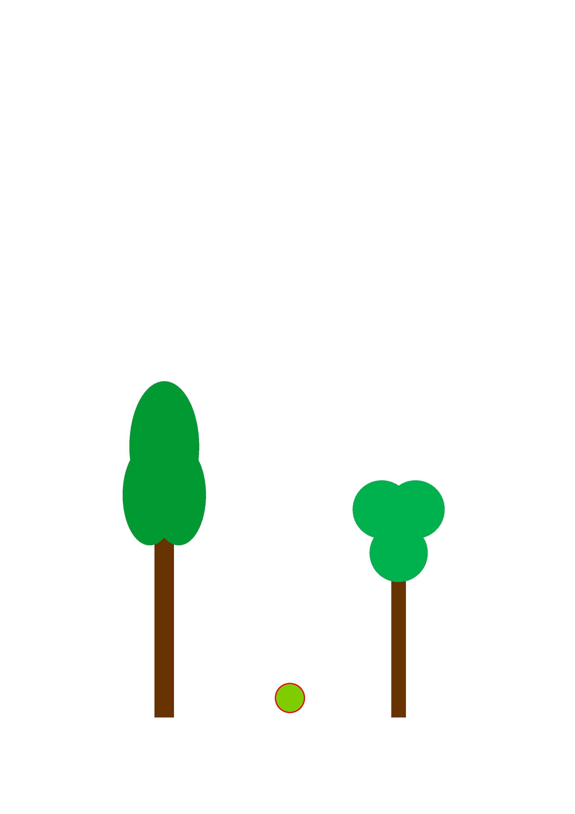
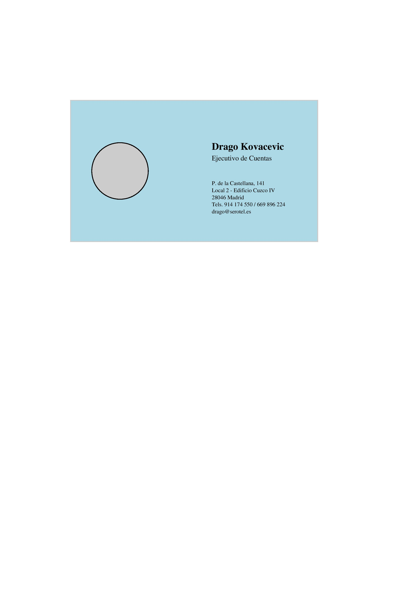
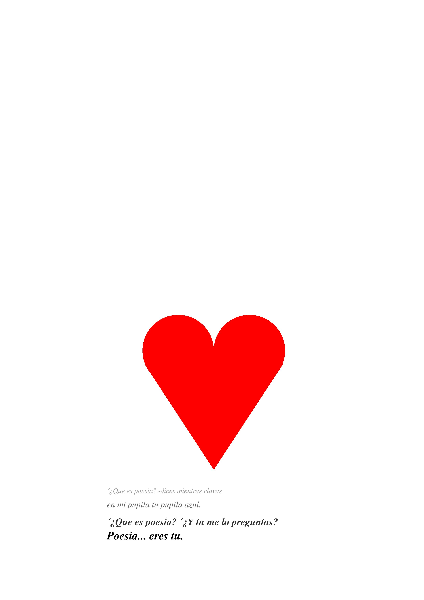
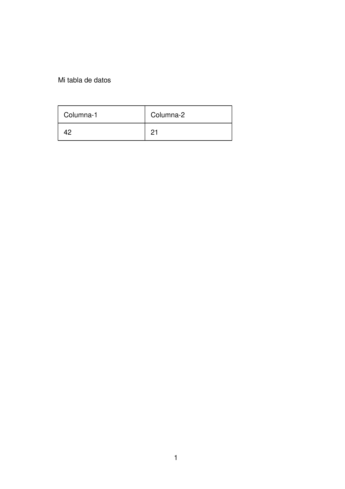
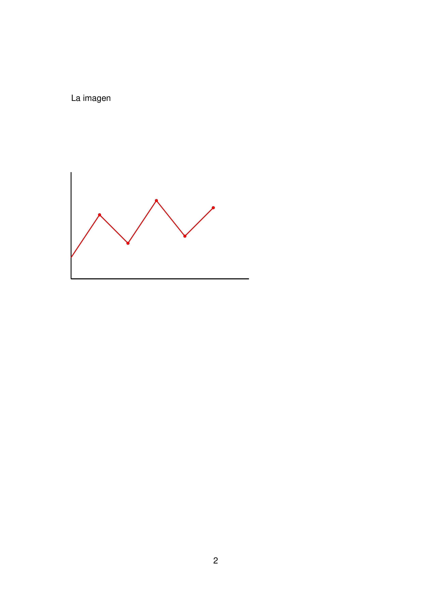

# Práctica 4: El lenguaje PostScript

## Ejercicios 

### Requisitos Mínimos

#### Ejercicio 1: Dibujo de Árboles (`Ej1_Arboles.ps`)
*   **Descripción**: Creación de una escena con dos árboles de distinto diseño y un elemento central.
*   **Técnicas**:
    *   Uso de `rlineto` y `closepath` para los troncos.
    *   Uso de `gsave`, `grestore`, `translate` y `scale` para crear copas elípticas en el primer árbol.
    *   Uso de círculos simples con `arc` para el segundo árbol y el detalle central.

#### Ejercicio 2: Tarjeta de Visita (`Ej2_Tarjeta_de_Visitas.ps`)
*   **Descripción**: Diseño de una tarjeta personal para "Drago Kovacevic".
*   **Técnicas**:
    *   Fondo en color celeste mediante `setrgbcolor`.
    *   Logotipo circular con relleno gris (`setgray`) y borde negro.
    *   Jerarquía de texto usando las fuentes `Times-Bold` y `Times-Roman` en distintos tamaños (14pt, 10pt y 8pt).

#### Ejercicio 3: Corazón y Poesía (`Ej3_Corazon_y_Poesia.ps`)
*   **Descripción**: Composición visual de un corazón seguida de un poema con efectos de escala.
*   **Técnicas**:
    *   **Construcción del Corazón**: Combinación geométrica de dos círculos superiores y un triángulo inferior unidos por un bloque de relleno central.
    *   **Efecto de Texto**: El texto varía progresivamente en tamaño (de 10pt a 16pt) y en tono de gris (de 0.6 a negro puro) para crear un efecto visual de énfasis.

---

### Requisitos Ampliados

#### Ejercicio 4 (Opcional 1): Círculos Concéntricos (`Ej_Opcional_1.ps`)
*   **Descripción**: Diseño en formato apaisado con una serie de círculos de colores y una carita sonriente.
*   **Técnicas**:
    *   Configuración de página horizontal mediante `setpagedevice`.
    *   Traslación del origen al centro de la página (`421 297`) para facilitar el dibujo concéntrico.
    *   Uso de `stroke` para definir los rasgos de la cara sobre el círculo central.

#### Ejercicio 5 (Opcional 2): Documento Multipágina (`Ej_Opcional_2.ps`)
*   **Descripción**: Documento de dos páginas que incluye una tabla de datos y una gráfica de cresta.
*   **Página 1**: Tabla construida manualmente con líneas (`lineto`) y datos tabulados.
*   **Página 2**: Representación de una gráfica con ejes cartesianos, una línea de cresta en rojo y puntos destacados en los nodos.
*   **Técnicas**: Uso del comando `showpage` para gestionar la transición entre páginas y numeración de pie de página.

