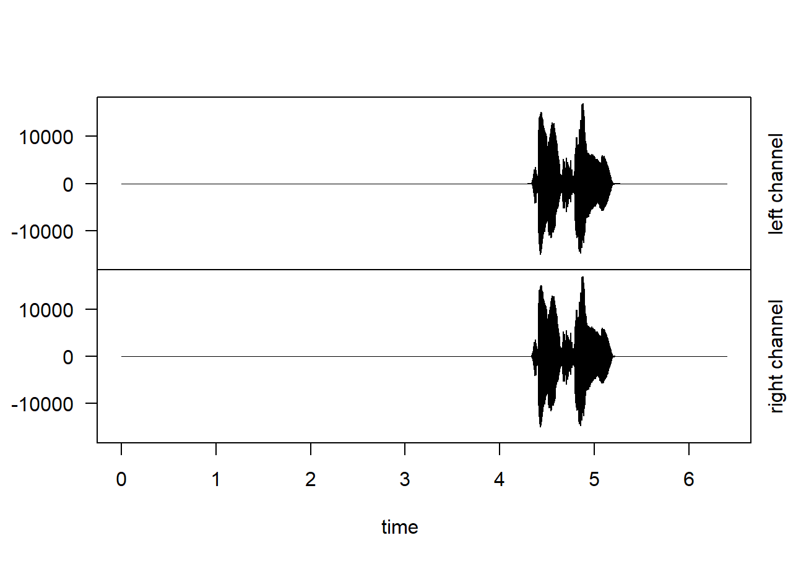
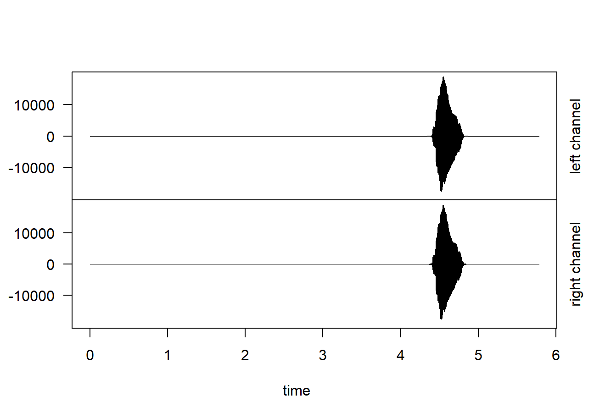
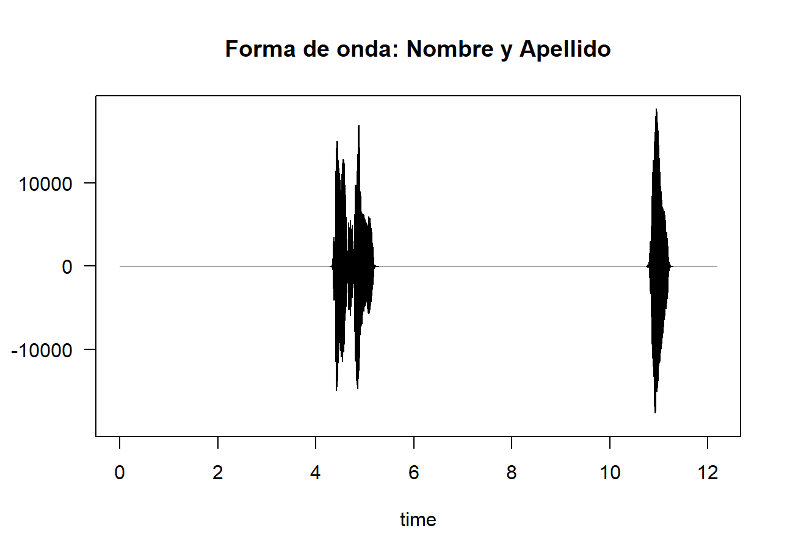
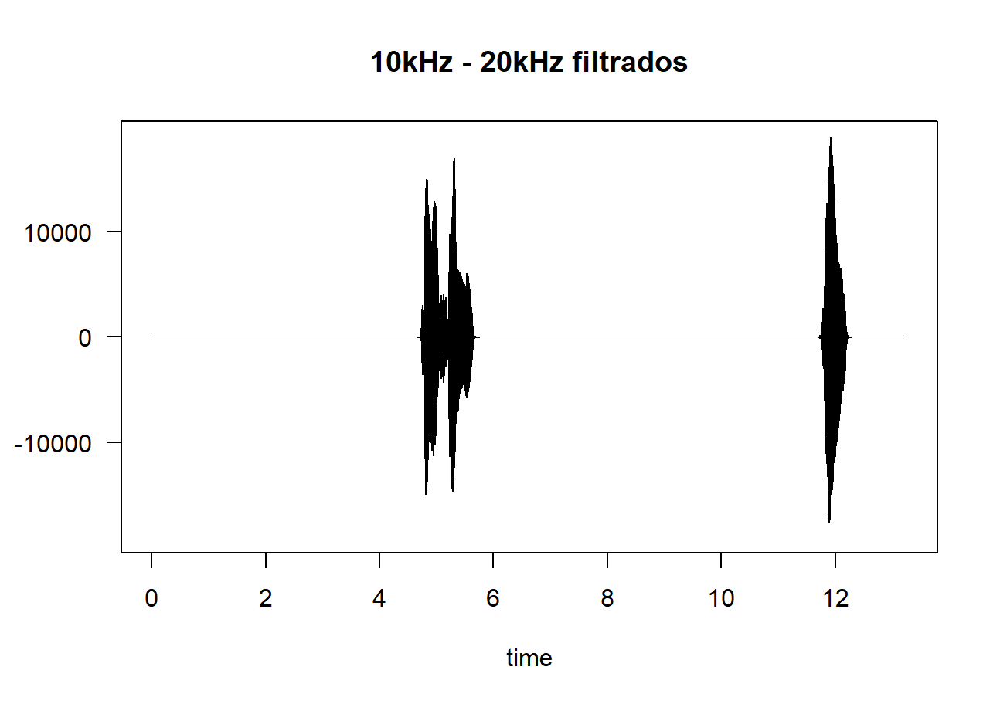
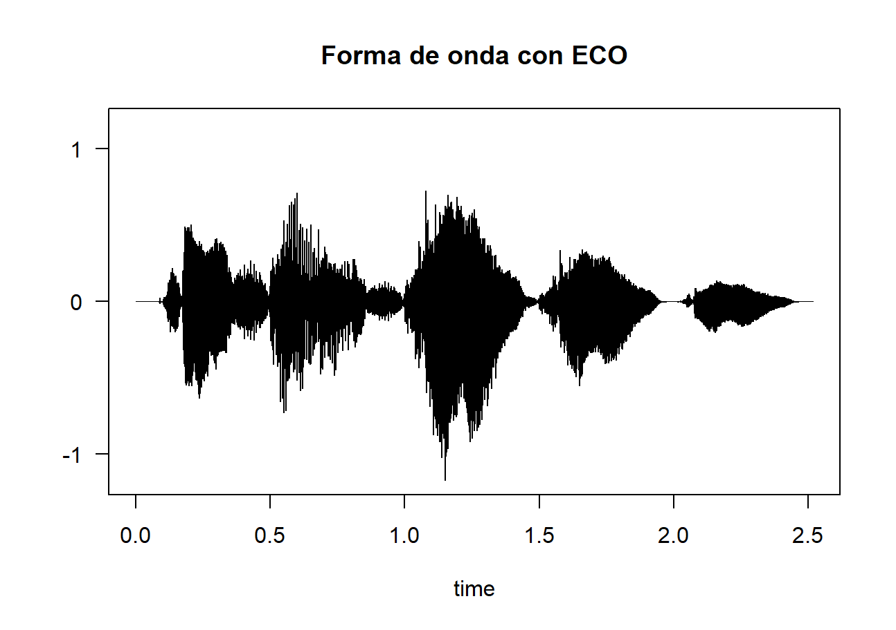
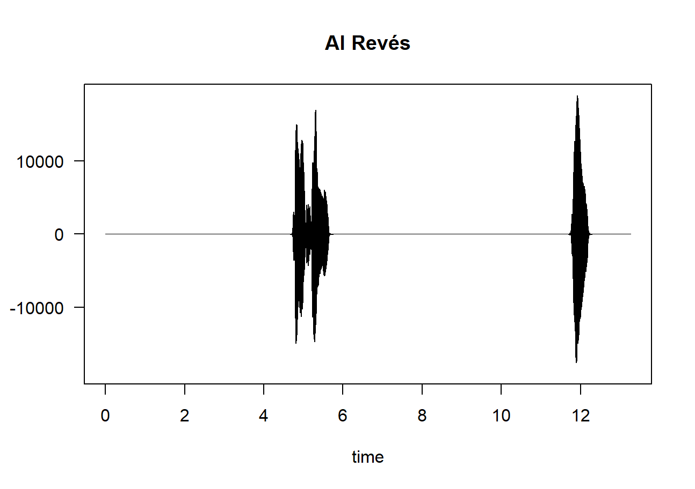

# Práctica 5

## Desarrollo de la Práctica

### 1. Creación y Lectura de Sonidos

Se han generado dos archivos de audio iniciales con el nombre y el apellido del autor. Posteriormente, se cargan en el entorno de R y se representan sus formas de onda.

```r
nombre <- readWave("nombre.wav")
apellido <- readWave("apellido.wav")
plot(nombre)
plot(apellido)
```

**Formas de onda iniciales:**

|            Nombre           |             Apellido            |
| :-------------------------: | :-----------------------------: |
|  |  |

### 2. Información de las Cabeceras

Se utiliza la función `str()` para obtener los metadatos de los archivos (frecuencia de muestreo, bits, canales, etc.).

```r
str(nombre)
str(apellido)
```

### 3. Unión de Sonidos (Nombre Completo)

Se combinan ambos audios en una sola señal secuencial para formar el nombre completo.

```r
nombre_completo <- pastew(apellido, nombre, at="end", output="Wave")
plot(nombre_completo, main = "Nombre y Apellido")
writeWave(nombre_completo, "basico.wav")
```

**Resultado de la unión:**


*El archivo resultante se almacena como `basico.wav`.*

---

## Requisitos Ampliados

### 4. Filtro de Frecuencia

Se aplica un filtro de banda eliminada para suprimir las frecuencias situadas entre **10.000Hz y 20.000Hz**.

```r
filtrado <- bwfilter(nombre_completo, f = 44100, from = 10000, to = 20000, bandpass = FALSE, output = "Wave")
writeWave(filtrado, "filtrado.wav")
```

**Onda tras el filtrado:**


### 5. Efectos Especiales: Eco y Reversa

A partir del audio `basico.wav`, se han aplicado dos efectos adicionales:

1. **Eco:** Generación de repeticiones con retardo y amplitud decreciente.
2. **Reversa:** Inversión de la señal.

```r
# Eco
sonido_eco <- echo(nombre_completo, f=44100, amp = c(0.5, 0.2), delay = c(0.5, 0.1), output = "Wave")

# Reversa
sonido_alreves <- revw(nombre_completo, output = "Wave")
```

|       Efecto Eco      |         Efecto Reversa         |
| :-------------------: | :----------------------------: |
|  |  |

---

