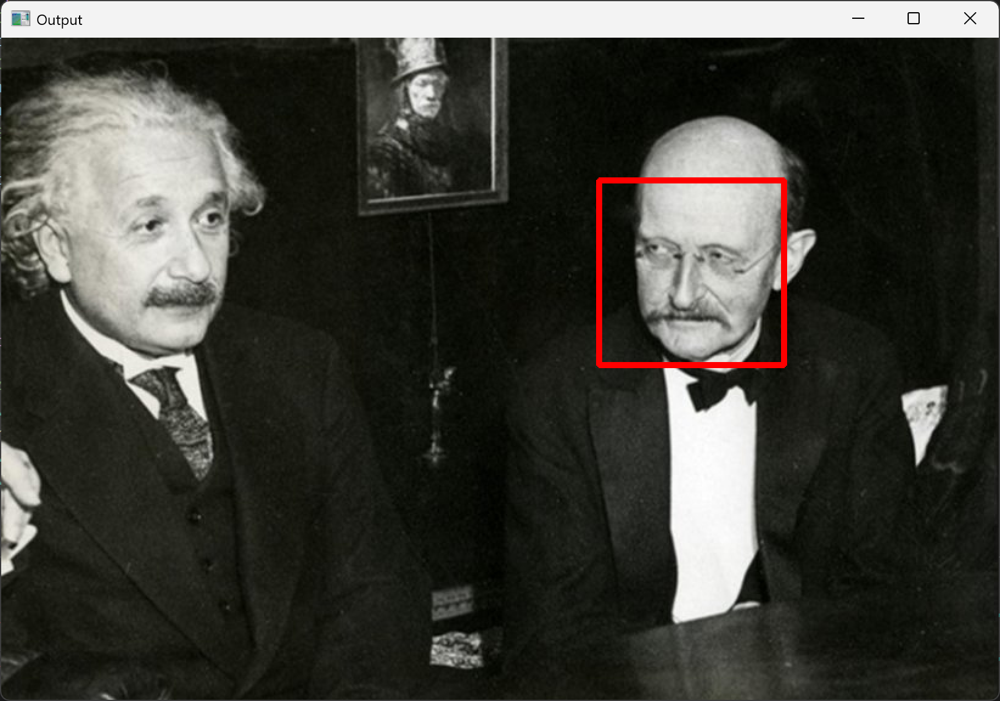
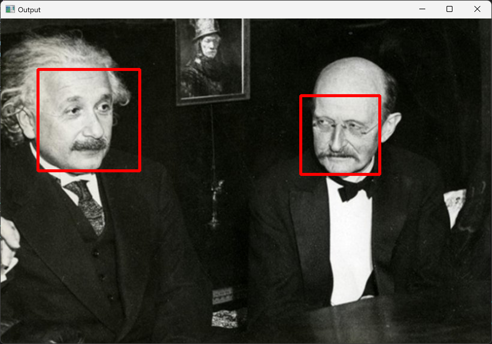
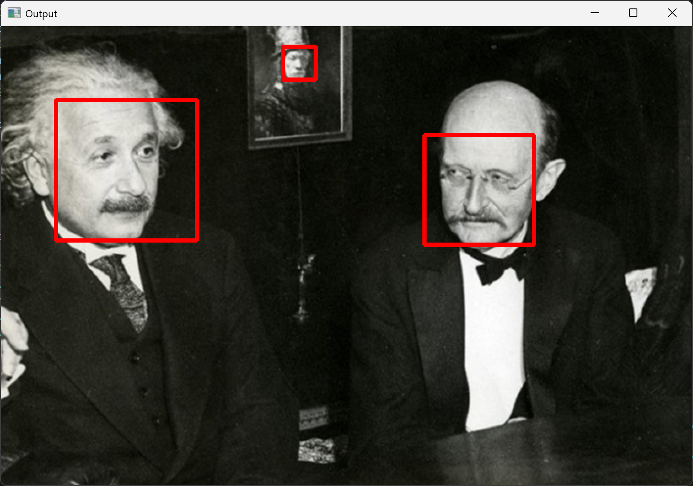
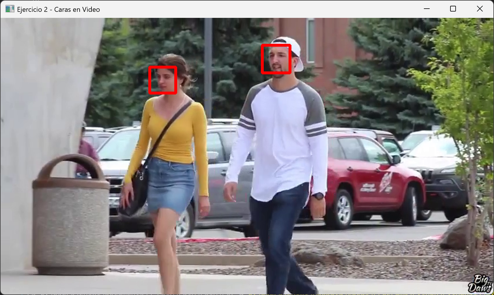
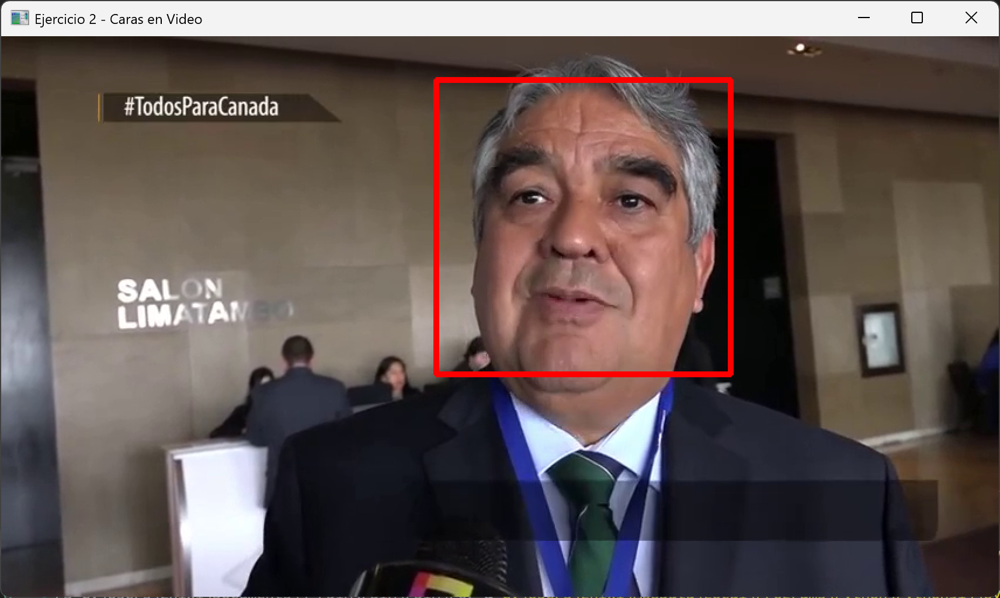
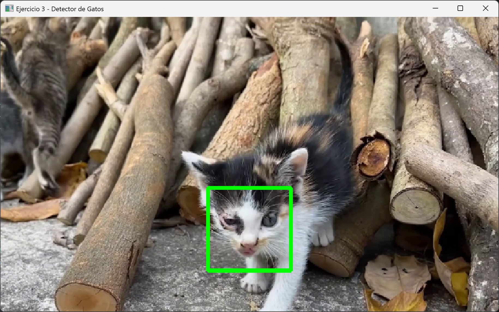
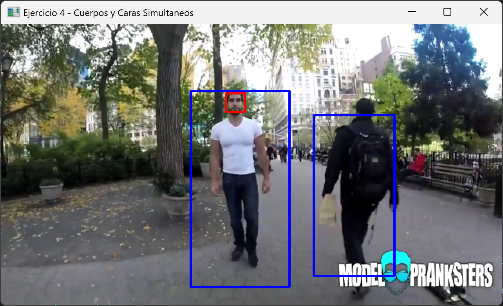

# Práctica 6: Reconocimiento de Imágenes

---

## Ejercicio 1: Reconocimiento de caras en imágenes

**Descripción:** Implementación de un programa para detectar rostros humanos en vista frontal sobre una fotografía estática (`einstein_plank.jpg`) utilizando el clasificador `haarcascade_frontalface_alt.xml`.

Se ha estudiado el impacto del parámetro `scaleFactor`, comprobando cómo influye en la fiabilidad y exhaustividad de la detección:

### Resultados según `scaleFactor`

* **`scaleFactor = 1.5`**: El filtro es muy selectivo y rápido. Logra identificar las dos caras principales del primer plano, pero pasa por alto el cuadro del fondo.
  

* **`scaleFactor = 1.15`**: Al reducir el factor, el algoritmo analiza subventanas más densas, manteniendo la detección de los rostros principales de forma precisa.
  

* **`scaleFactor = 1.05`**: Al aproximar el valor a 1.0, el detector incrementa su sensibilidad. Como resultado, es capaz de identificar con éxito el rostro difuminado presente en el cuadro del fondo.
  

---

## Ejercicio 2: Reconocimiento de caras de personas en vídeos

**Descripción:** Procesado de vídeo para la detección de rostros humanos empleando bucles continuos de captura (`cv2.VideoCapture`). Para optimizar el rendimiento y asegurar la robustez del algoritmo, cada fotograma se convierte dinámicamente a escala de grises antes de aplicar `detectMultiScale`. Los rostros localizados se encuadran con un rectángulo rojo.

### Capturas 

---

## Ejercicio 3: Reconocimiento de caras de gatos en vídeos

**Descripción:** Adaptación de la lógica de procesado de vídeo orientada al reconocimiento biométrico de felinos. En este ejercicio se hace uso del clasificador extendido `haarcascade_frontalcatface_extended.xml`, el cual ofrece una mayor tasa de acierto y tolerancia ante inclinaciones de la cabeza de los animales en entornos dinámicos en comparación con el modelo base.

### Captura 

---

## Ejercicio 4: Reconocimiento simultáneo de cuerpos y caras

**Descripción:** Desarrollo de un sistema de análisis paralelo e integrado que ejecuta de forma simultánea dos clasificadores de cascada distintos sobre el mismo flujo de vídeo. El script procesa de manera concurrente el modelo de cuerpo entero (`haarcascade_fullbody.xml`) y el de rostros frontales (`haarcascade_frontalface_alt.xml`). 

Para asegurar una visualización clara y cumplir con el requisito de simultaneidad, los resultados se superponen sobre la misma ventana interactiva empleando códigos de color diferenciados: **Azul** para los cuerpos y **Rojo** para los rostros.

### Captura

