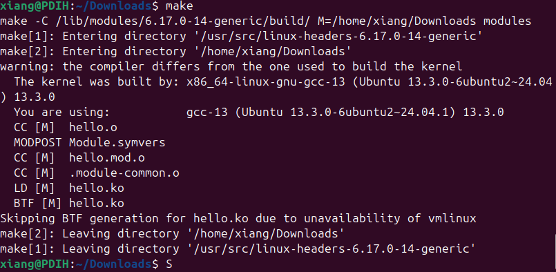
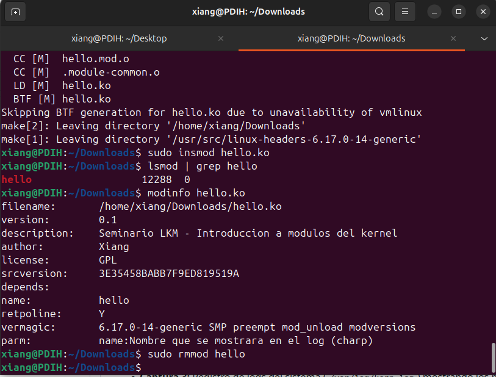
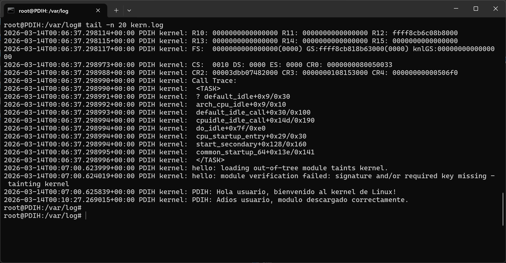

# Seminario: Módulos Cargables del Kernel

## 1. Proceso de Desarrollo

### Preparación del entorno
Primero, he preparado el sistema instalando las cabeceras del kernel correspondientes a mi versión:
```bash
sudo apt-get update
sudo apt-get install linux-headers-$(uname -r)

```

### Compilación

He utilizado el código `hello.c` y un `Makefile` para compilar el módulo. Al ejecutar el comando `make`, se ha generado el archivo `hello.ko`.

### Carga y Pruebas

Para verificar el funcionamiento, he seguido estos pasos:

1. **Carga del módulo:** `sudo insmod hello.ko`
2. **Verificación en memoria:** `lsmod | grep hello`
3. **Información del módulo:** `modinfo hello.ko`
4. **Descarga del módulo:** `sudo rmmod hello`

## 2. Resultados y Capturas

* **Captura 1:** Proceso de compilación con `make`.
  
* **Captura 2:** Salida de `lsmod` y `modinfo`.
  
* **Captura 3:** Registro de logs del sistema (`/var/log/kern.log`) mostrando los mensajes `EBB: Hello world` y `EBB: Goodbye world`.
  
